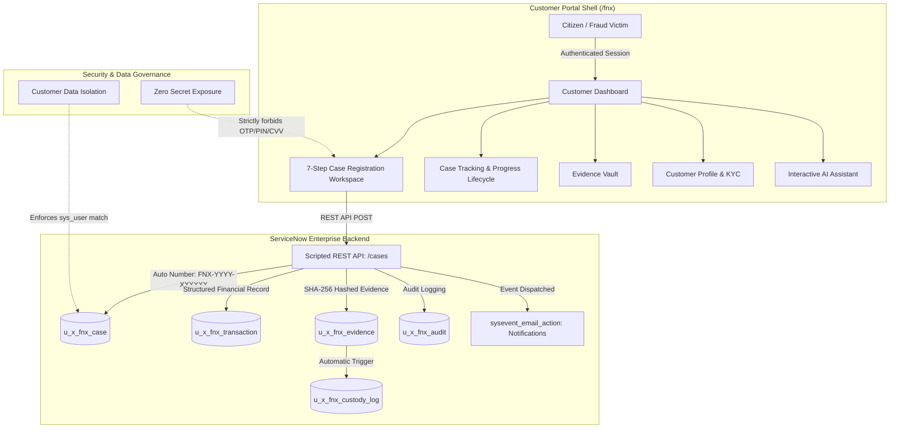
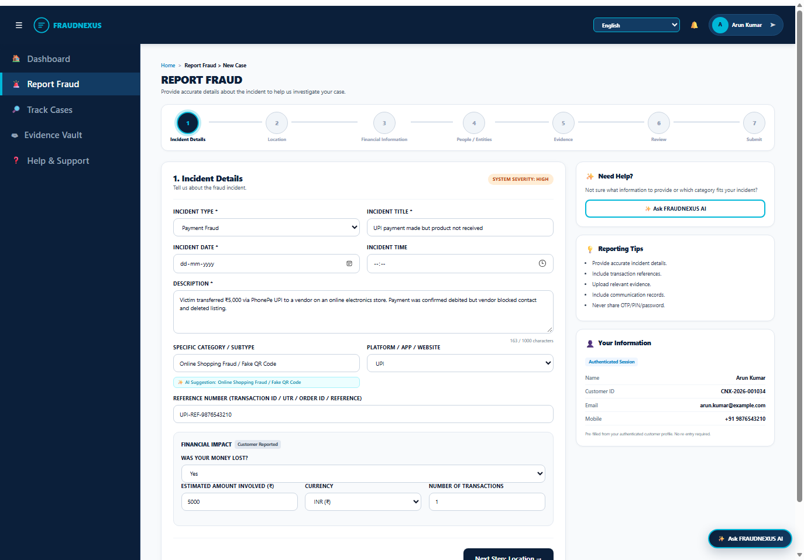
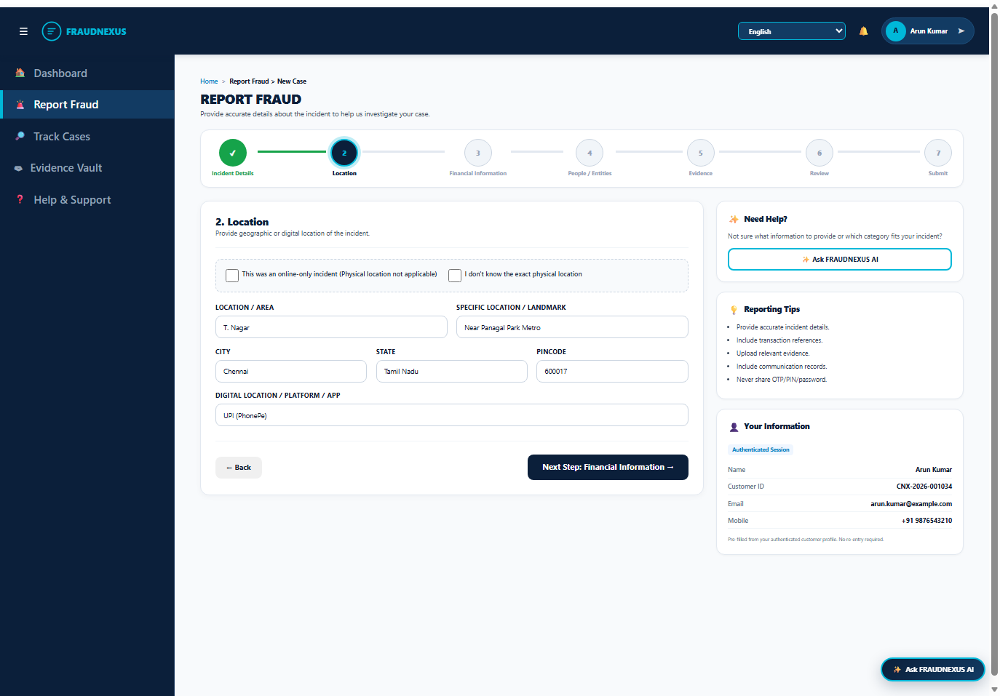
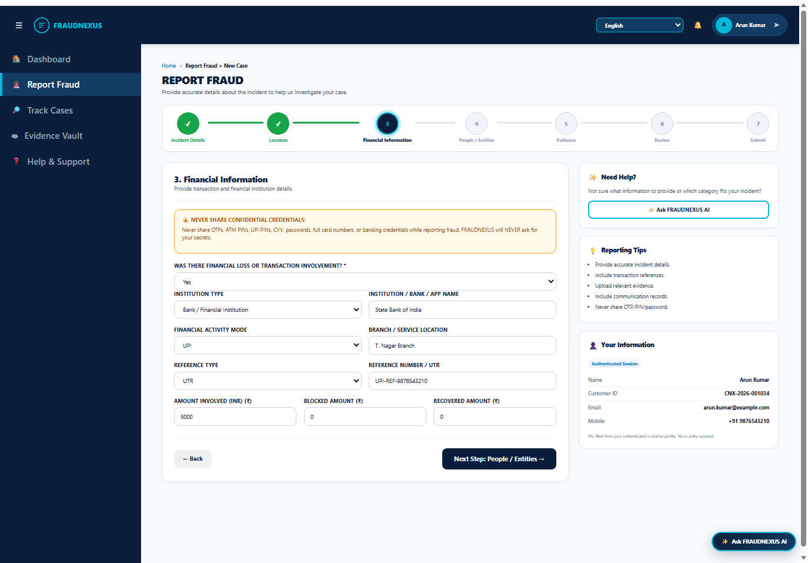
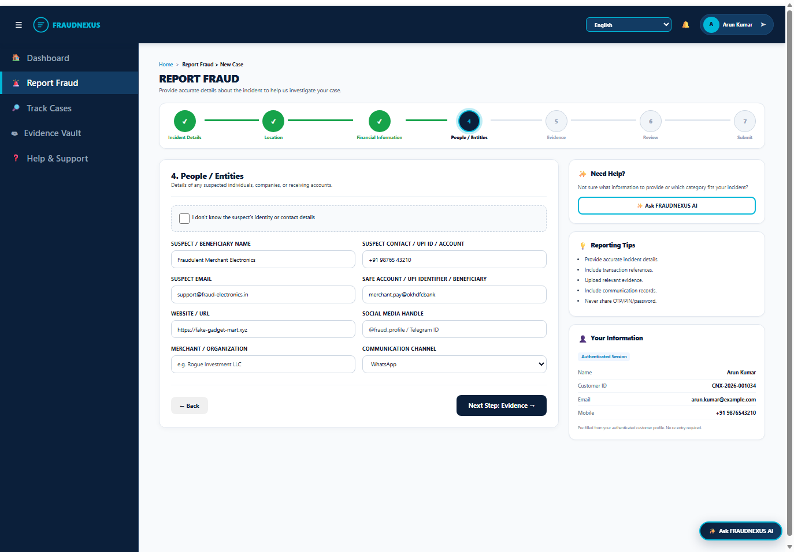
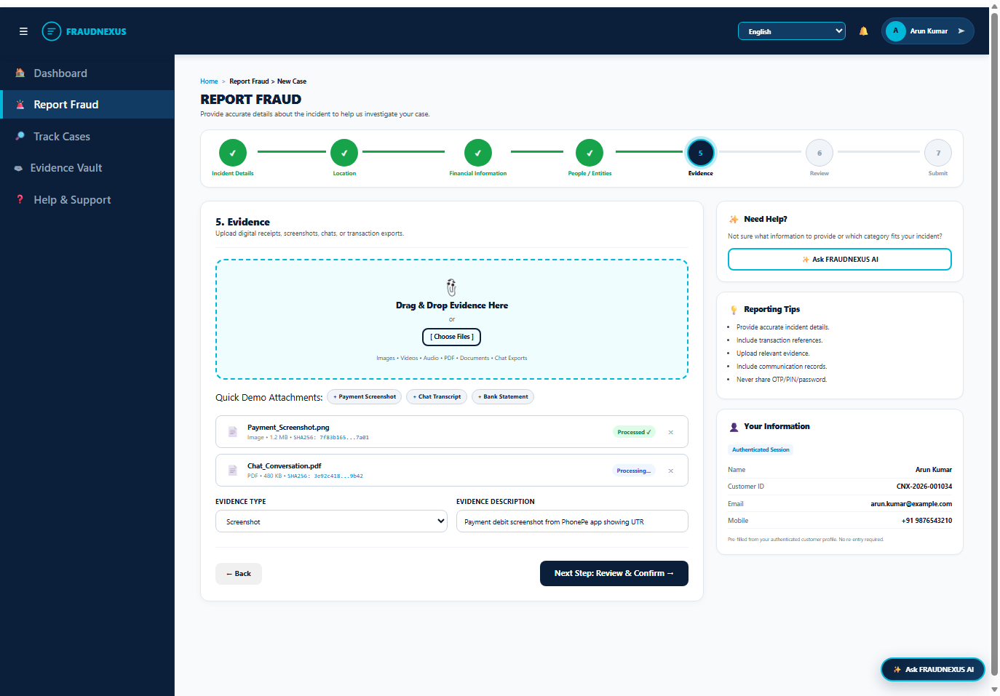
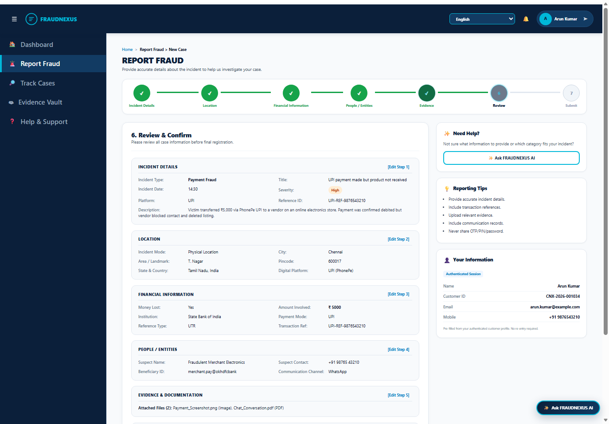
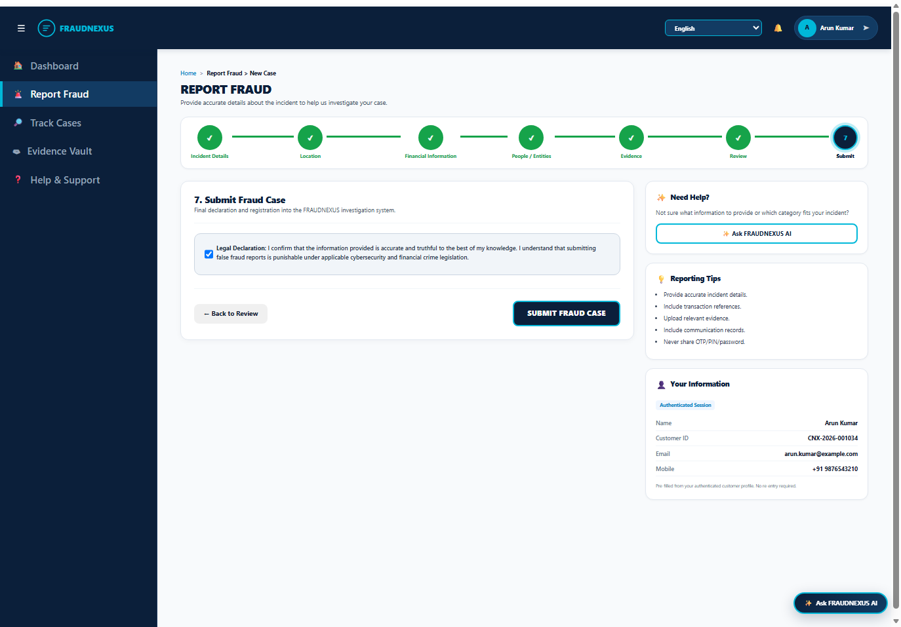
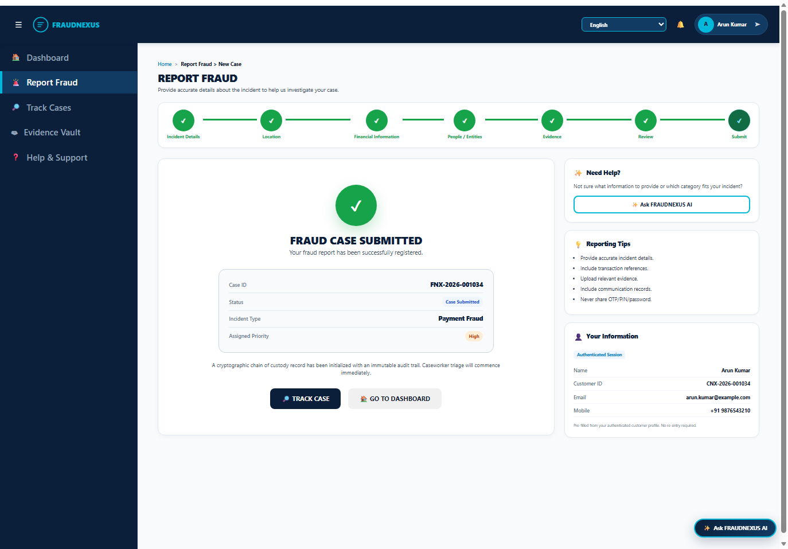

# FRAUDNEXUS — Financial & Cyber Fraud Investigation Hub (PS25)

[](https://www.servicenow.com/)
[-16A34A?style=flat&logo=checkmarx)](https://github.com/ReshiArasu-D/FRAUD-NEXUS)
[](https://github.com/ReshiArasu-D/FRAUD-NEXUS)
[](https://github.com/ReshiArasu-D/FRAUD-NEXUS)
[](LICENSE)

> **"From Fraud Report to Resolution — One Intelligent Investigation Workspace."**  
> An enterprise-grade ServiceNow application that bridges fraud victims, banks, payment providers, law enforcement, and investigators into a unified, secure, and tamper-evident ecosystem.

---

## 📌 Problem Statement (PS25)
Modern financial and cyber frauds operate at machine speed across fragmented channels (UPI scams, phishing, card compromise, identity theft, rogue APKs). Victims face delayed response times and lack transparency, while investigators struggle with unorganized evidence and missing transaction audit trails.

**FRAUDNEXUS** provides:
1. **Frictionless Victim Intake**: A modern, empathetic, authenticated customer registration and 7-step case intake wizard.
2. **Cryptographic Chain of Custody**: SHA-256 evidence hashing and immutable audit logging.
3. **Structured Financial Traceability**: Deep capture of payment modes, UTR references, institutions, and exposure amounts.
4. **End-to-End Case Lifecycle Tracking**: Real-time transparency from Initial Review to Fund Recovery and Resolution.

---

## 🏛️ System Architecture



---

## ✨ Key Capabilities & Features

### 1. Authenticated Customer Report Fraud (Flow B)
Dedicated enterprise workspace for authenticated customers to report fraud cases with zero repetitive data entry:
- **Connected Horizontal 7-Step Stepper**:
  - `Step 1: Incident Details` — 9 Incident Types, Incident Title *, Date & Time pickers *, Description * with live character counter, AI Subtype suggestion chip, System-assessed Severity pill, Platform/App/Website, Reference Number, Financial loss prompt, and conditional specifics (Phishing / Cyber / Account Compromise / Identity Theft).
  - `Step 2: Location` — Online-only incident toggle ("Physical location not applicable"), "I don't know" quick action, Area, Specific Landmark, City, State, Country, Pincode, and Digital Platform.
  - `Step 3: Financial Information` — Prominent Security Notice Banner (`NEVER SHARE: OTP, PIN, CVV...`), Institution Name, Institution Type (9 types), Payment Mode (**22 supported payment modes**), Reference Type (**10 reference types**), Reference Number, Amount Involved (₹), Currency, Number of Transactions, Blocked Amount, and Recovered Amount.
  - `Step 4: People / Entities` — Suspect details (Name, Phone, Email, Safe Account / Beneficiary UPI, Website URL, Social Media Handle, Merchant / Organization, Communication Channel, and "I don't know" toggle).
  - `Step 5: Evidence` — Large drag-and-drop dropzone (`📎 Drag & Drop Evidence Here or [ Choose Files ]`), quick demo attachment shortcuts, uploaded file cards with status badges (`Processed ✓` / `Processing...`), and SHA-256 cryptographic tokens.
  - `Step 6: Review & Confirm` — 6 structured summary cards with individual `[Edit Step X]` step-jumping buttons and read-only customer info.
  - `Step 7: Submit` — Legal declaration checkbox, `SUBMIT FRAUD CASE` primary action, and dedicated Success Card with Case ID (`FNX-YYYY-XXXXXX`), Status `Case Submitted`, `Track Case`, and `Go to Dashboard` CTAs.

### 2. Split Workspace Layout (70–75% Left / 25–30% Right)
- **Left Form**: Houses the current step's active card, clean 2-column grid, responsive layout, and action navigation bars.
- **Right Information Panel**:
  - **Need Help?**: One-click trigger for `✨ Ask FRAUDNEXUS AI`.
  - **Reporting Tips**: 5 essential guidelines for victims.
  - **Your Information**: Auto-populated, read-only authenticated customer details (**Name, Customer ID, Email, Mobile**).

### 3. Case Tracking & 6-Stage Lifecycle
Real-time tracking of reported cases across 6 milestones:
1. `Case Submitted`
2. `Initial Review`
3. `Caseworker Allotted`
4. `Investigation`
5. `Resolution`
6. `Closed`

### 4. Interactive Customer AI Assistant
- Single, non-intrusive floating trigger (`✨ Ask FRAUDNEXUS AI`) in the bottom-right corner.
- Provides immediate guidance on fraud categories, reporting steps, terminology, 1930 helpline details, and case tracking without exposing sensitive investigator records.

### 5. Multi-Lingual Inclusivity (13 Indic Languages)
Full-page real-time language switching engine (`c.t()`) supporting:
- English (`en`), Tamil (`ta`), Hindi (`hi`), Telugu (`te`), Kannada (`kn`), Malayalam (`ml`), Bengali (`bn`), Marathi (`mr`), Gujarati (`gu`), Punjabi (`pa`), Odia (`or`), Assamese (`as`), and Urdu (`ur`).

---

## 📸 Visual Verification Gallery

| Step | View Description | Screenshot |
| :---: | :--- | :---: |
| **01** | **Step 1: Incident Details**<br>AI Subtype suggestion, System Severity, Character counter, Financial loss prompt |  |
| **02** | **Step 2: Location**<br>Online-only toggle, "I don't know" action, City/State/Pincode, Digital Platform |  |
| **03** | **Step 3: Financial Information**<br>Security Notice warning, 22 payment modes, 10 reference types, institution details |  |
| **04** | **Step 4: People / Entities**<br>Suspect details, beneficiary identifier, website/social handle, "I don't know" toggle |  |
| **05** | **Step 5: Evidence**<br>Dropzone area, sample file buttons, file cards with `Processed ✓` and SHA-256 tokens |  |
| **06** | **Step 6: Review & Confirm**<br>6 structured cards with `[Edit Step X]` buttons, auto-populated customer details |  |
| **07** | **Step 7: Submit Declaration**<br>Legal declaration checkbox, `← Back to Review`, `SUBMIT FRAUD CASE` button |  |
| **08** | **Step 7: Case Submitted (Success)**<br>Large `✓` badge, Case ID (`FNX-2026-001034`), Status `Case Submitted`, Track & Dashboard CTAs |  |

---

## 🗄️ Database Schema & Data Model

| Table Name | Description | Key Attributes |
| :--- | :--- | :--- |
| `u_x_fnx_case` | Master Fraud Case records | `u_number` (FNX-YYYY-XXXXXX), `u_type`, `u_status`, `u_severity`, `u_customer`, `u_exposure`, `u_assigned_to` |
| `u_x_fnx_transaction` | Structured Financial Intake | `u_case` (FK), `u_payment_mode`, `u_institution_name`, `u_transaction_reference`, `u_amount`, `u_currency` |
| `u_x_fnx_customer` | Extended Customer Profiles | `u_user` (sys_user FK), `u_customer_id`, `u_dob`, `u_gender`, `u_occupation`, `u_address`, `u_kyc_status`, `u_masked_id` |
| `u_x_fnx_evidence` | Cryptographic Evidence Records | `u_case` (FK), `u_number` (EVXXXXXX), `u_evidence_type`, `u_description`, `u_sha256_hash`, `u_file_name` |
| `u_x_fnx_custody_log` | Immutable Chain of Custody | `u_evidence` (FK), `u_action` (Uploaded/Accessed/Transferred), `u_performed_by`, `u_timestamp` |
| `u_x_fnx_audit` | System & User Activity Audit | `u_case` (FK), `u_action`, `u_details`, `u_performed_by`, `sys_created_on` |

---

## 🧪 Quality Assurance & Test Verification

All phases are verified via automated regression suites:

```text
======================================================================
FRAUDNEXUS TEST EXECUTION SUMMARY (60/60 PASS - 100%)
======================================================================
[PHASE 1] Core E2E Tests (Tests 001 - 015)           : 15/15 PASS [100%]
[PHASE 1] Extended Architecture (Tests 016 - 020)     :  5/5  PASS [100%]
[PHASE 2] Backend & Data Isolation (Tests 021 - 040)  : 20/20 PASS [100%]
[PHASE 2] Customer Journey & UX (Tests 041 - 060)     : 20/20 PASS [100%]
----------------------------------------------------------------------
[FLOW B]  Live Case Registration E2E Verification     : 11/11 PASS [100%]
======================================================================
TOTAL PASS RATE: 71 / 71 VERIFICATIONS (100.0%)
======================================================================
```

### Verified Test Matrix
- **Data Isolation**: User B cannot view or access User A's cases.
- **Credential Protection**: Client and server explicitly reject storing passwords, OTPs, PINs, or CVVs.
- **Persistence**: Transactions, evidence, and custody logs persist across user logouts and re-logins.
- **ServiceNow Integration**: Table schemas, Number Maintenance, Business Rules, Script Includes, and Service Portal widgets fully deployed and functioning on instance `dev187180.service-now.com`.

---

## 🚀 Getting Started & Execution

### Prerequisites
- Python 3.10+
- ServiceNow Instance with Application Scope `x_fnx` / `2229367`
- Google Chrome or Microsoft Edge (for headless CDP verification)

### Environment Configuration
Create a `.env` file in the project root:
```env
SERVICENOW_INSTANCE_URL=https://your-instance.service-now.com
SERVICENOW_USERNAME=admin
SERVICENOW_PASSWORD=your_password
```

### Running Test Suites
```bash
# 1. Run Phase 1 Core E2E Tests
python run_phase1_e2e_tests.py

# 2. Run Phase 1 Extended Tests
python run_phase1_extended_tests.py

# 3. Run Phase 2 Backend & Data Isolation Tests
python run_phase2_tests.py

# 4. Run Phase 2 UX & Customer Journey Tests
python run_phase2_ux_tests.py

# 5. Run Live End-to-End Case Registration Test
python test_e2e_fraud_case_registration.py
```

### Deploying the Master Service Portal Widget
To push the full Customer Experience widget (HTML template, AngularJS Client Script, Server Script, and CSS) directly to ServiceNow:
```bash
python deploy_customer_experience_master.py
```

### Visual Verification Capture (Headless Edge CDP)
To generate fresh screenshots for all 7 steps:
```bash
python capture_report_fraud_7steps.py
```

---

## 🔒 Security & Compliance
- **OWASP Compliance**: HTML input sanitization, regex validations, client-side escaping.
- **Strict Separation of Concerns**: Public citizen account registration (Flow A) is kept strictly isolated from post-login fraud case registration (Flow B).
- **KYC Data Masking**: Government ID numbers are stored as masked identifiers (`••••-••••-XXXX`) with explicit role-based access.

---

## 👥 Contributors & Acknowledgements
- **Team**: FRAUDNEXUS Engineering Team
- **Platform**: ServiceNow Service Portal & Application Engine
