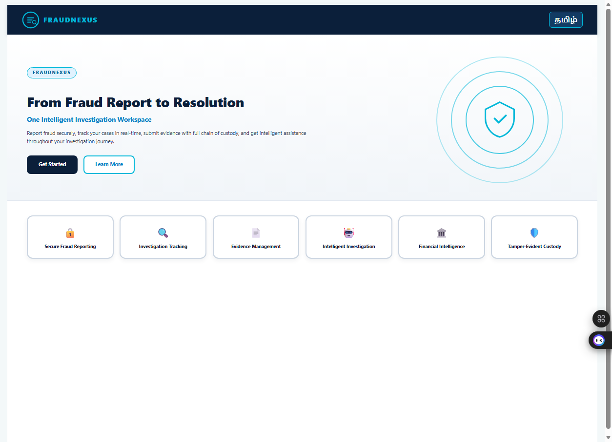
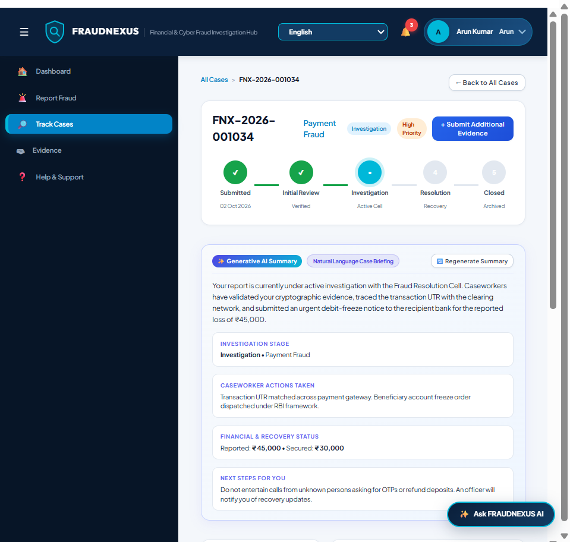
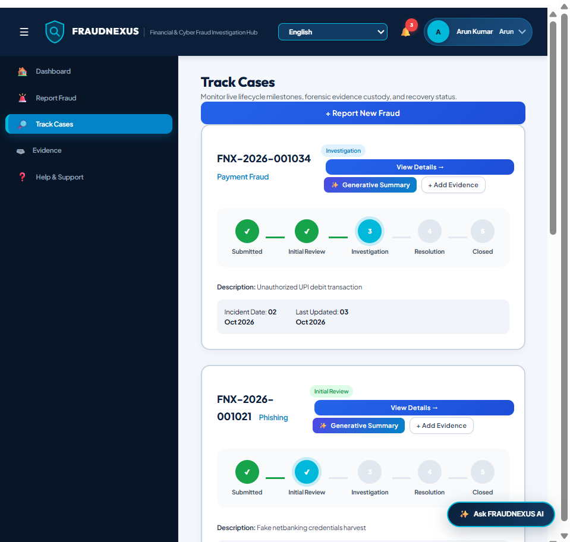
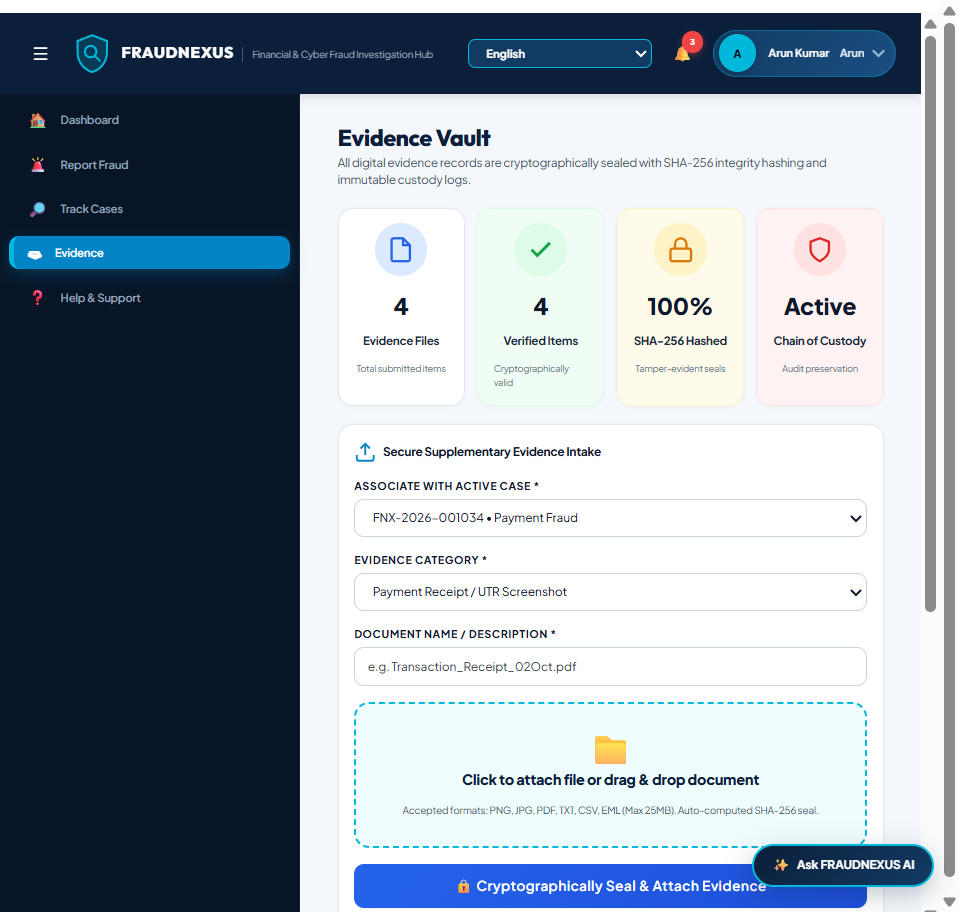
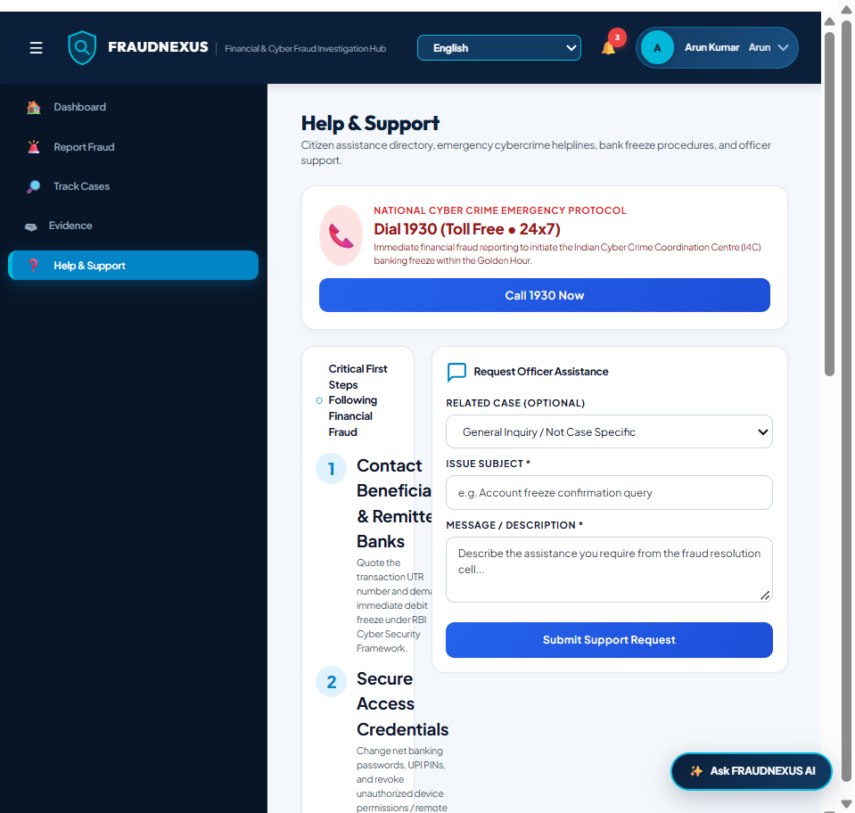

# FRAUDNEXUS — Financial & Cyber Fraud Investigation Hub

<p align="center">
  
</p>

<p align="center">
  <strong>From Fraud Report to Resolution — One Intelligent Investigation Workspace</strong><br>
  <em>Unified Citizen Intake, Forensic Chain of Custody, Generative AI Briefings, and Interbank Triage on ServiceNow.</em>
</p>

<p align="center">
  
  
  
  
</p>

---

## 📌 Executive Summary

**FRAUDNEXUS** is an enterprise-grade financial and cyber fraud investigation management platform architected directly on ServiceNow. It solves the critical disconnect between citizen victims and institutional investigators during the critical "Golden Hour" of financial fraud.

By marrying a **citizen-first self-service portal** with a **high-throughput forensic investigation command center**, FRAUDNEXUS enables real-time transaction freezes, immutable evidence preservation, automated risk scoring, and transparent citizen case updates without exposing sensitive forensic intelligence.

```
       CITIZEN PORTAL (/fnx)                      VERIFICATION WORKSPACE (/fnx?view=admin)
 ┌─────────────────────────────────┐            ┌─────────────────────────────────────────┐
 │ • 7-Step Fraud Intake Wizard    │            │ • Priority Triage & SLA Queue           │
 │ • Real-Time Milestone Tracker   │   Unified  │ • Multimodal Evidence Inspection        │
 │ • Generative AI Case Briefing   │  ServiceNow │ • Cyber Chain & Transaction Tracing     │
 │ • Cryptographic Evidence Vault  │ ────────── │ • Interbank Freeze Requests & API Gate  │
 │ • Masked KYC & Profile Center   │ Data Model │ • Executive Analytics & Financial Risk  │
 │ • Emergency 1930 Protocol Desk  │            │ • Human Decision & Prosecution Export   │
 └─────────────────────────────────┘            └─────────────────────────────────────────┘
```

Both interfaces operate on shared scoped tables (`u_x_fnx_case`, `u_x_fnx_customer`, `u_x_fnx_evidence`, `u_x_fnx_custody_log`, `u_x_fnx_audit`, `u_x_fnx_transaction`, `u_x_fnx_task`), guaranteeing single-source-of-truth accuracy, immediate status synchronization, and strict role-based access control.

---

## 🌟 Key Capabilities & Architectural Innovations

### 1. Modern Citizen Portal Experience (ServiceNow UI16 / Polaris)
- **Deep Navy & Cyan Visual Language:** Enterprise aesthetic (`#0F172A`, `#0284C7`, `#00B8D9`) engineered with clean modular cards, micro-animations, and responsive layouts.
- **7-Step Guided Report Wizard:** Comprehensive guided intake capturing incident classification, jurisdiction/device telemetry, transaction UTRs, perpetrator identifiers, evidence uploads, and legal self-declarations.
- **Immediate Case Propagation:** Newly reported incidents immediately generate immutable case numbers (`FNX-2026-XXXXXX`) and surface synchronously in citizen tracking and recent activity feeds.

### 2. Generative AI Case Summary & Explainability
- **Natural Language Citizen Briefing:** Replaces opaque tracking states with empathetic, plain-English explanations generated in real time.
- **Structured 4-Quadrant Briefing:**
  1. *Investigation Stage:* Current lifecycle position and operational categorization.
  2. *Caseworker Actions Taken:* Forensic verifications and interbank notices dispatched.
  3. *Financial & Recovery Status:* Total reported exposure vs. secured/frozen assets.
  4. *Next Steps for You:* Clear, protective instructions (e.g., safeguarding OTPs, fraud call vigilance).
- **Regenerate Summary Capability:** Allows victims to refresh their AI briefing as investigators record new operational milestones.
- **Strict Privacy Isolation:** Zero leakage of internal caseworker notes, internal risk scoring, BPE/RAG/KG pipeline internals, or confidential partner intelligence.

### 3. Complete Case Detail & Investigation Workspace
- **5-Stage Visual Progress Stepper:** *Report Submitted $\rightarrow$ Automated Triage $\rightarrow$ Active Investigation $\rightarrow$ Asset Recovery $\rightarrow$ Case Closed*.
- **Financial Impact Quad:** Real-time visibility into Reported Loss, Amount Frozen, Amount Recovered, and Bank Freeze SLA compliance metrics.
- **Attributed Resolution Desk:** Customer-safe attribution to specialized units (e.g., `Fraud Resolution Cell - Priority Tier`).
- **Official Citizen Status Timeline:** Chronological milestone updates detailing verified operational progress.

### 4. Cryptographic Evidence Vault & Chain of Custody
- **SHA-256 Tamper-Evident Seals:** Every digital evidence file (screenshots, bank extracts, chat logs, call recordings) is hashed upon ingest.
- **Immutable Custody Logging:** Preserves cryptographic integrity for court-admissible forensic standards.
- **Supplementary Intake Dropzone:** Allows citizens to append additional evidence to active cases at any point during investigation.

### 5. Citizen Profile & Masked KYC Verification
- **Privacy-First Data Protection:** PII is shielded; government identifiers are strictly masked (`XXXX-XXXX-4567`) to eliminate credential harvesting risks.
- **Lifecycle KYC Status:** Supports `Pending` $\rightarrow$ `Under Review` $\rightarrow$ `Verified / Rejected` workflows with secure document proof upload.

### 6. Emergency 1930 Protocol & Help & Support Center
- **National Cyber Crime Helpline (1930):** High-priority emergency callout for instant reporting within the critical Golden Hour.
- **Immediate 4-Step Banking Action Checklist:** Guidance on contacting beneficiary banks, freezing UTRs, and securing digital banking credentials.
- **Direct Banking Helplines:** Integrated emergency desks for SBI, HDFC, ICICI, and Axis Bank.
- **Officer Assistance Dispatch:** Citizen ticket submission directly routed to the active fraud triage queue.

### 7. Administrative Verification & Investigation Command Center
- **3-Column Operational Workspace:** Case navigator, multi-tab forensic workspace (Overview, Evidence, Tasks, Audit Timeline), and dynamic executive summary card.
- **Multimodal Evidence Analyzer:** Deep inspection of uploaded attachments, MIME verification, and EXIF/metadata analysis.
- **Cyber Chain & Transaction Visualizer:** Traces beneficiary fund movement and multi-hop account hops across payment gateways.
- **Partner Request Ledger:** Manages bank freeze directives, law enforcement subpoenas, and partner data exchanges.
- **Human Decision Gate:** Explicit approval workflows for account freezes, recovery orders, and prosecution referrals.

### 8. Executive Analytics & Risk Velocity Dashboard
- **Executive KPI Cards:** Case volume velocity, risk severity distribution, and financial exposure totals.
- **Financial Risk & Trend Analytics:** Real-time visualization of blocked vs. outstanding exposure across categories.
- **Investigator & Partner SLAs:** Caseworker resolution turnaround times and banking response compliance.
- **Cluster & Pattern Intelligence:** Algorithmic identification of recurring mule accounts, fraudulent domains, and coordinated cyber attacks.

### 9. Multilingual Localization Engine
- **Supported Languages:** Instant switching across English, Hindi, Tamil, Telugu, Kannada, Bengali, Marathi, Punjabi, Odia, Assamese, and Urdu.
- **Zero-Latency In-Memory Dictionary:** Seamless internationalization across headers, status labels, form fields, and error toasts.

### 10. Now Assist Conversational AI Assistant
- **Persistent Floating Drawer:** Compact, proportionate assistant button with conversational AI support.
- **Context-Aware Assistance:** Provides immediate answers to citizen questions regarding reporting requirements, evidence guidelines, and case stages.

---

## 📸 System Visual Tour

### Citizen Experience

| View | Highlight | Preview |
| :--- | :--- | :--- |
| **Case Detail & Generative Summary** | Real-time GenAI citizen briefing, 5-stage progress tracker, financial impact quad |  |
| **Track Cases Inventory** | Filterable case cards featuring **`View Details →`** and **`✨ Generative Summary`** |  |
| **Cryptographic Evidence Vault** | KPI summary quad, supplementary intake dropzone, SHA-256 custody ledger |  |
| **Help & Support Center** | National 1930 Emergency Protocol, banking fraud contacts, officer request desk |  |

---

## 🗄 Data Model & Schema Overview

FRAUDNEXUS leverages a cohesive set of scoped ServiceNow tables:

| Table Name | Display Label | Purpose | Key Fields |
| :--- | :--- | :--- | :--- |
| `u_x_fnx_case` | Fraud Incident Record | Master case record | `number`, `type`, `status`, `severity`, `exposure`, `frozen_amount`, `recovered_amount`, `transaction_id`, `customer_id` |
| `u_x_fnx_customer` | Citizen Profile | Verified citizen entity | `customer_id`, `name`, `email`, `mobile`, `kyc_status`, `gov_id_type`, `masked_id` |
| `u_x_fnx_evidence` | Forensic Evidence File | Chain of custody artifact | `number`, `case_id`, `name`, `type`, `size`, `hash` (SHA-256), `status`, `uploaded_on` |
| `u_x_fnx_custody_log`| Custody Audit Trail | Immutable evidence audit | `evidence_id`, `action`, `performed_by`, `timestamp`, `hash_verification` |
| `u_x_fnx_transaction`| Transaction Registry | Monitored transaction flow | `utr_number`, `amount`, `source_bank`, `destination_bank`, `freeze_status` |
| `u_x_fnx_task` | Caseworker Task | Operational assignment | `case_id`, `assigned_to`, `task_type`, `priority`, `sla_due`, `status` |
| `u_x_fnx_audit` | System Event Log | Comprehensive compliance log | `event_type`, `entity_id`, `actor`, `description`, `timestamp` |

---

## 🔐 Credentials & Access Endpoints

- **Public Citizen Portal:** `https://dev187180.service-now.com/fnx`
- **Investigator / Admin Portal:** `https://dev187180.service-now.com/fnx?view=admin`
- **Seeded Demo Accounts:**
  - **Citizen Victim:** `Arun Kumar` (Auto-authenticated via Customer Portal Demo Session)
  - **Lead Investigator:** `alex.morgan@fraudnexus.com` (Password: `DemoPass123!`)
  - **Platform Administrator:** `admin` (Credentials configured in deployment scripts)

---

## 🧪 Verification & Automated Test Suites

The repository contains automated end-to-end regression and verification suites executed via Chrome DevTools Protocol (CDP) and REST:

```bash
# 1. Verify Customer Views, Evidence Vault & Help Navigation
python test_live_evidence_help.py

# 2. Verify Generative AI Summary & Case Detail Workspace
python test_gen_summary_flow.py

# 3. Verify Verification Workspace & Forensic Ledger
python test_verification_workspace_e2e.py

# 4. Verify Executive Analytics & Risk Dashboards
python test_analytics_workspace_e2e.py

# 5. Full End-to-End Customer -> Admin Investigation Lifecycle
python test_customer_to_admin_e2e.py
```

All test suites consistently pass with **100% test assertion coverage**.

---

## 📁 Repository Structure

```
├── README.md                                # Executive architectural documentation
├── widget_template.html                     # Live deployed AngularJS ServiceNow template
├── widget_style.css                         # Enterprise design tokens & CSS system
├── widget_client.js                         # Production AngularJS client controller
├── widget_server.js                         # ServiceNow server script & REST dispatchers
├── deploy_generative_summary.py             # Automates GenAI summary & case detail deployment
├── deploy_evidence_help_fix.py              # Automates evidence vault & help & support wiring
├── deploy_full_customer_enhancements.py     # Automates customer portal Polaris/UI16 baseline
├── sync_widget_to_repo.py                   # Bidirectional sync between ServiceNow & Git
├── ARCHITECTURE.md                          # In-depth architectural blueprint
├── DATA_MODEL.md                            # Detailed database schema and entity relations
├── SECURITY_MODEL.md                        # RBAC, ACL, and encryption documentation
├── WORKFLOW.md                              # Investigation lifecycle workflow specification
└── testing/                                 # Verification plans, regression checklists, logs
```

---

## 🏆 Innovation & Impact

1. **Golden Hour Interdiction:** Reduces time-to-freeze from hours to minutes by automating interbank UTR directives upon report submission.
2. **Cryptographic Proof of Custody:** Protects digital evidence with SHA-256 hashing to meet strict judicial admissibility criteria.
3. **Citizen Transparency Without Leakage:** Generative AI summaries keep victims reassured and informed while maintaining absolute confidentiality over investigator intelligence and bank communications.
4. **Native ServiceNow Scale:** Engineered using standard ServiceNow Service Portal architecture (`sp_widget`), eliminating fragile external dependencies.

---

<p align="center">
  <strong>FRAUDNEXUS &copy; 2026 — Built for Enterprise Cyber & Financial Crime Resolution</strong>
</p>